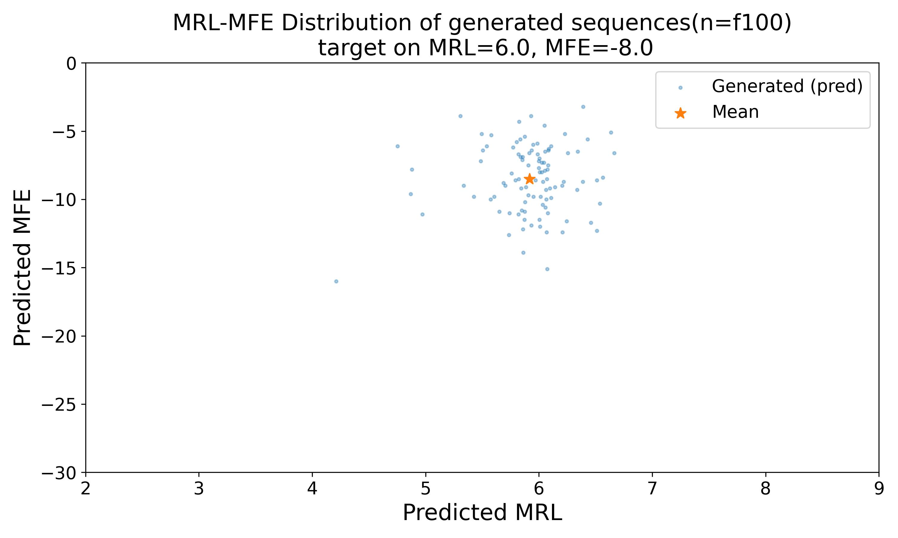
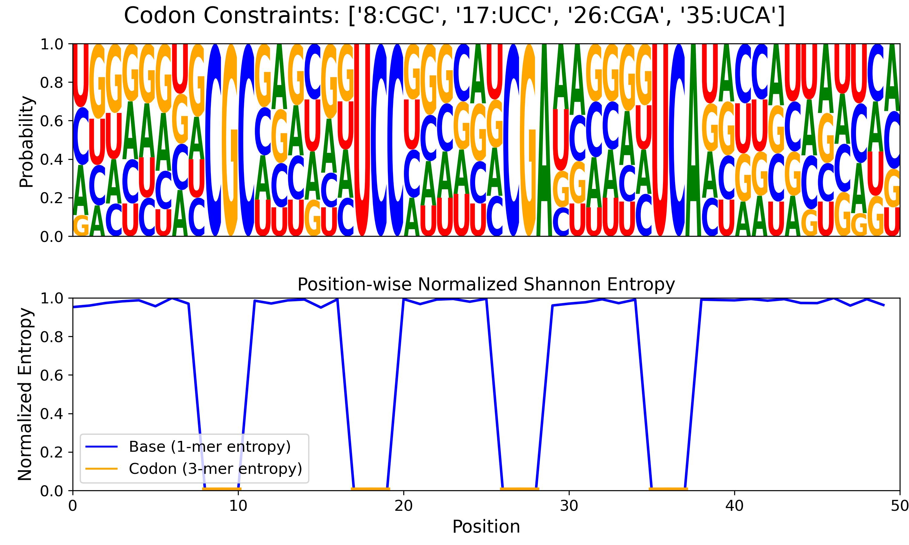
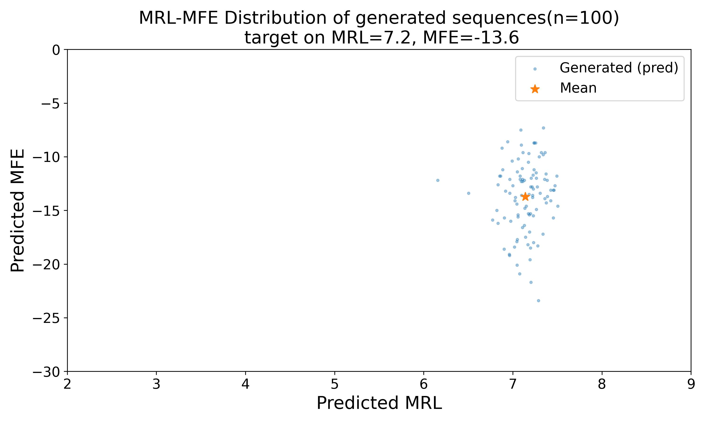
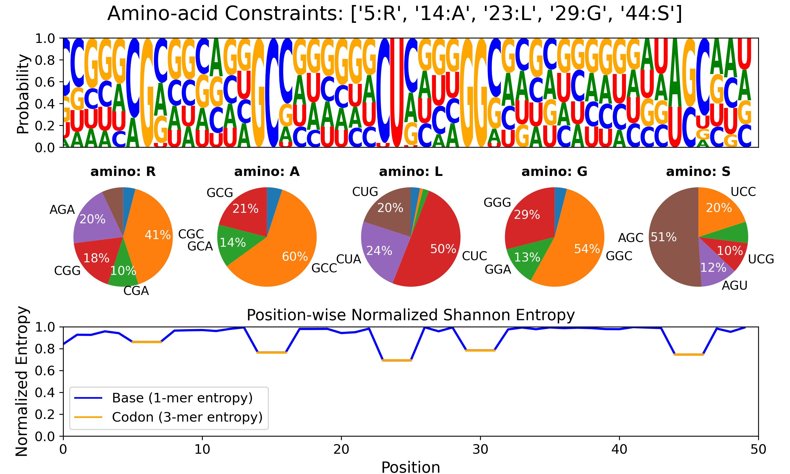

# UTR-Diffusion

Official implementation of the paper:

> **UTR-Diffusion: Conditional Diffusion Modeling for Multi-objective and Constrained UTR Design**  
> ECCB 2026 Proceedings

UTR-Diffusion is a diffusion-based generative framework for 5′ UTR sequence design that enables:

- **Continuous control of translation-related indicators**
  - Mean Ribosome Load (MRL)
  - Minimum Free Energy (MFE)
- **Explicit codon- or amino-acid constraints** at user-specified positions
- **Multi-objective conditional generation**

---

# 🔬 Overview

UTR-Diffusion supports:

- Unconditional generation
- Continuous conditional generation (MRL, MFE)
- Constrained generation (codon / amino-acid clamping)
- Multi-label generation (MRL + MFE)
- Evaluation pipeline (MRL/MFE prediction)

---

# 📦 Installation (Conda)

We recommend installing dependencies via the provided `environment.yaml`.

```bash
git clone https://github.com/satolab-isct/utr-diffusion
cd utr-diffusion

# create conda environment
conda env create -f environment.yaml

# activate
conda activate utr-diffusion
```
---

# Pretrained Checkpoints

The pretrained UTR-Diffusion model weights are hosted on Hugging Face:

https://huggingface.co/Satolab-isct/utr-diffusion-checkpoint

You can download the main checkpoint directly:

```bash
mkdir -p checkpoints
wget -O checkpoints/MRL_MFE_967k_ep_2k_ts_200_beta_0.01_cond_1_uncond_0.2_drop_0.2_lr_1e-4_at_2000epoch.pt \
  https://huggingface.co/Satolab-isct/utr-diffusion-checkpoint/resolve/main/checkpoints/MRL_MFE_967k_ep_2k_ts_200_beta_0.01_cond_1_uncond_0.2_drop_0.2_lr_1e-4_at_2000epoch.pt
```

---

# 🚀 Quick Start (CLI)
## 1) Codon-constrained example

Example: generate sequences targeting MRL=4.0, MFE=-20.0 with codon constraints at specific positions
(codon start positions; e.g., pos 8 means the codon starting at nucleotide 8, covering positions 8–10)

> Note: You can use either `T` or `U` in codons (inputs with `U` will be converted to `T` internally).

```bash
python design_utr.py \
  --mode codon \
  --targets "4.0,-20.0" \
  --codon 8:CGC 32:UCA \
  --out outputs/codon_demo.fasta \
  --device cuda:0
```

Output:

outputs/codon_demo.fasta

## 2) Amino-acid-constrained example

Example: generate sequences targeting MRL=8.0, MFE=-2.0 with amino-acid constraints at specific positions
(amino start positions; e.g., pos 5 means the codon starting at nucleotide 8, covering positions 5–7).

```bash
python design_utr.py \
  --mode amino \
  --targets "8.0,-2.0" \
  --amino 5:R 26:L \
  --out outputs/amino_demo.fasta \
  --device cuda:0
```

Output:

outputs/amino_demo.fasta

# 📊 Optional: Evaluate generated sequences (MRL/MFE prediction)

Evaluation is bundled directly in this repository.
The standalone companion repository utr-diffusion-eval is also available, but no separate installation is required for the integrated workflow here.

MFE prediction relies on ViennaRNA. Please make sure `RNAfold` is installed and available in your PATH.

```bash
command -v RNAfold
RNAfold --version
```
If these commands work, the following evaluation CLI should run normally.

## 1) Codon-constrained example

```bash
python design_utr.py \
  --mode codon \
  --targets "5.9,-8.7" \
  --codon 8:CGC 17:UCC 26:CGA 35:UCA \
  --out outputs/codon_demo.fasta \
  --do-eval \
  --device cuda:0
```

### Outputs:

outputs/codon_demo.fasta

outputs/codon_demo.csv — predicted MRL/MFE values

outputs/codon_demo_dist.jpg — distribution on the MRL–MFE plane

outputs/codon_demo_constraint.jpg — position-wise nucleotide probability and Shannon entropy

### Example output figures

<p align="center">
  
  
</p>


## 2) Amino-acid-constrained example
```bash
python design_utr.py \
  --mode amino \
  --targets "7.2,-13.6" \
  --amino 5:R 14:A 23:L 29:G 44:S \
  --out outputs/amino_demo.fasta \
  --do-eval \
  --device cuda:0
```

### Outputs:

outputs/amino_demo.fasta

outputs/amino_demo.csv — predicted MRL/MFE values

outputs/amino_demo_dist.jpg — distribution on the MRL–MFE plane

outputs/amino_demo_constraint.jpg — position-wise nucleotide probability and Shannon entropy

### Example output figures

<p align="center">
    
    
</p>

---

## ⚙️ Arguments (Summary)

| Argument | Description |
|--------|-------------|
| --mode | Generation mode (`codon`, `amino`) |
| --targets | Target values `"MRL,MFE"` |
| `--codon` | Codon constraints (e.g., `8:CGC`) |
| --amino | Amino-acid constraints (e.g., `5:R 26:L`) |
| --out | Output FASTA file |
| --device | `cuda:0` or `cpu` |
| --do-eval | Enable evaluation pipeline |
